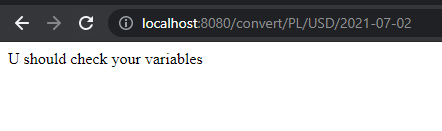

# currency Calculator

## Problem Statement

Your task is to write a Rest Service with Spring that convert currency rate betwen two currencies with date from the currencies have to be taken from the database. Database need to be fill with data from European Central Bank.

## Goal

The goal of this service is to take 3 parameters (currency from, currency to and date) and response with currency rate between this two currencies.

## Input

Program input will be received in GetMapping parameters.

### Example 1 When we write good request:

/convert/EUR/PLN/2021-07-02

### Example 2 When we write bad request:

/convert/EUR/PL/2021-07-02

## Output

Service output should return ResponseEntity with HTTPStatus with body: currency from, currency to, date and rate between this 2 currencies when HTTP Status is ok, or body: U should check your variables when HTTPStatus is Bad_Request.

### Example 1 When we write good request:

### Example 2 When we write bad request:

 ---

## License & copyright
This application uses the exchange data from European Central Bank.

https://www.ecb.europa.eu/stats/eurofxref/eurofxref-daily.xml
